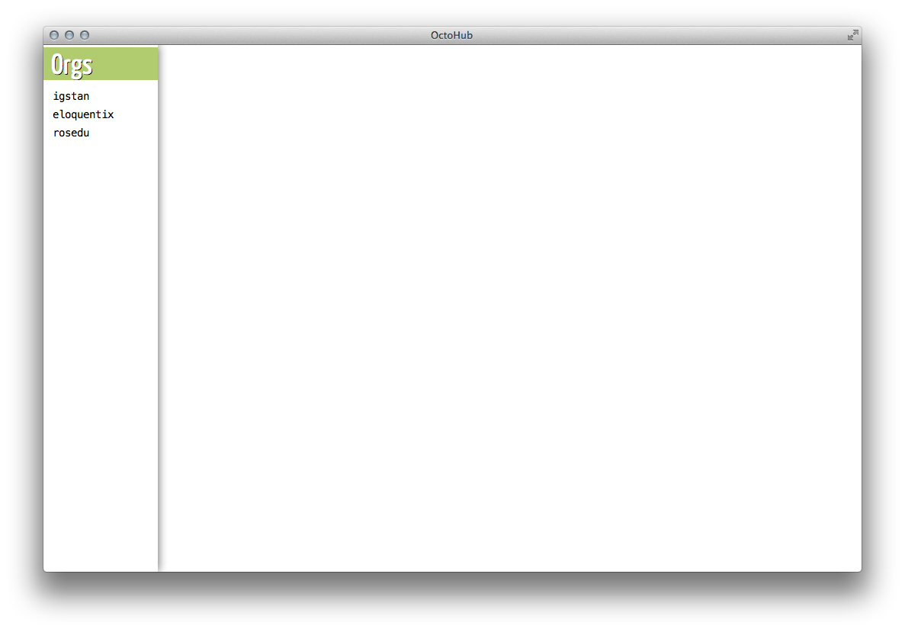
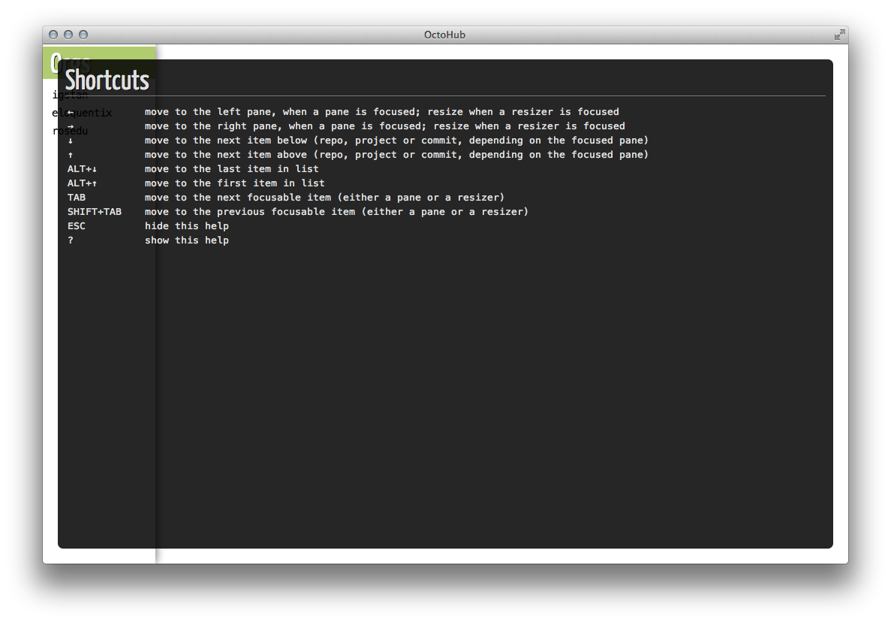
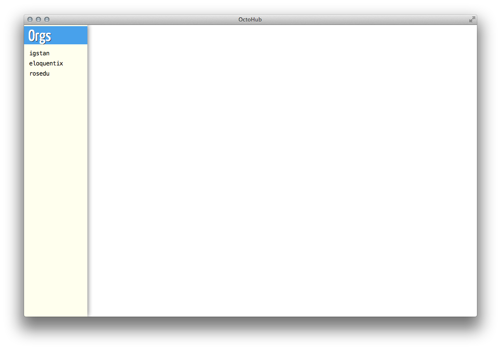
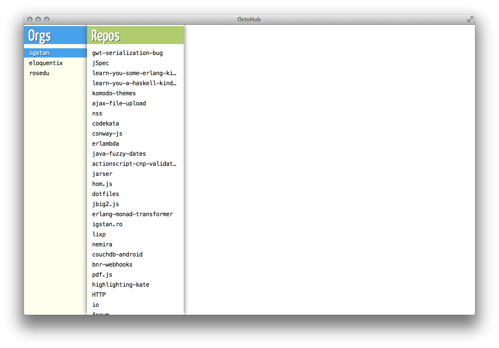
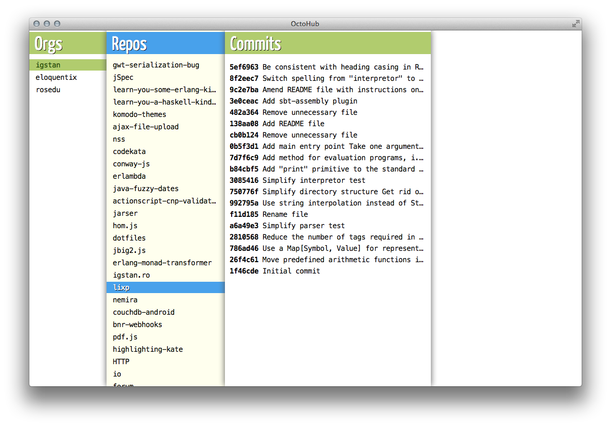
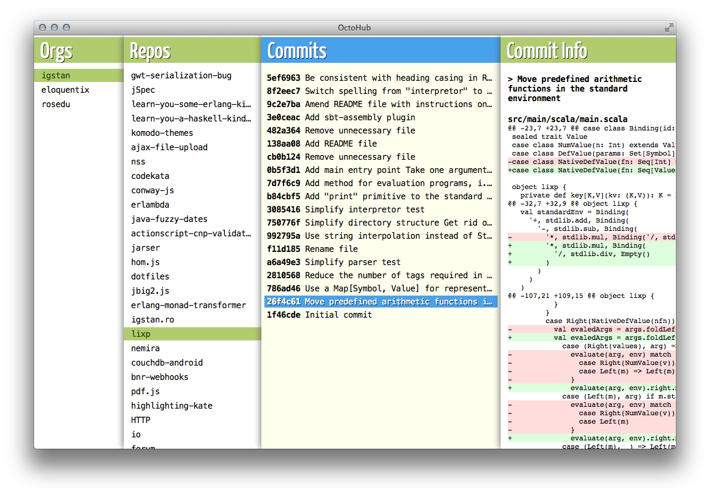
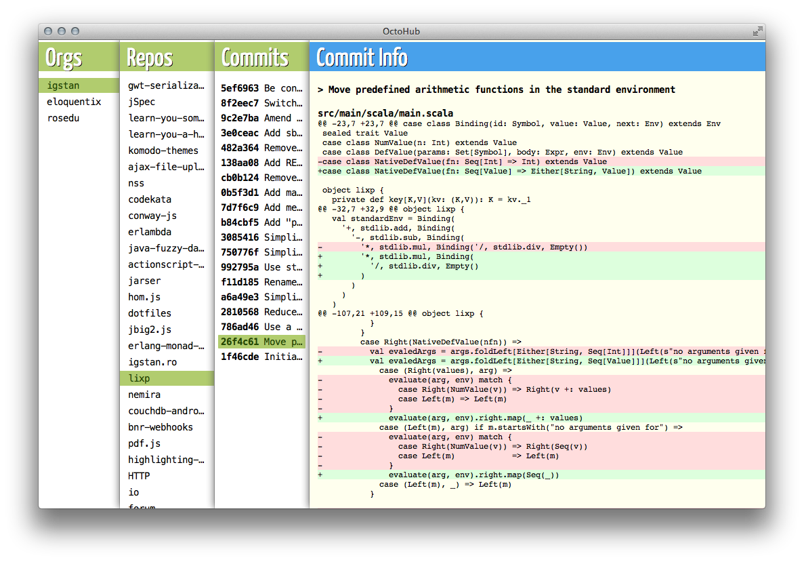

OctoHub
=======

An alternative web UI for GitHub.

Motivation
----------

Although I'm not a heavy Vim or Emacs user, I do use shortcuts. A lot. I'm also
using GitHub a lot, but their web interface is not particulary shortcut friendly.

At some point I had the idea of mapping GitHub data onto [Miller columns][0] and
provide decent shorcuts for navigating between these columns (arrows mostly).

The end result is this project. Far from being usable on a daily basis, but I
think it's a good start. For my needs at least.

[0]: http://en.wikipedia.org/wiki/Miller_columns
